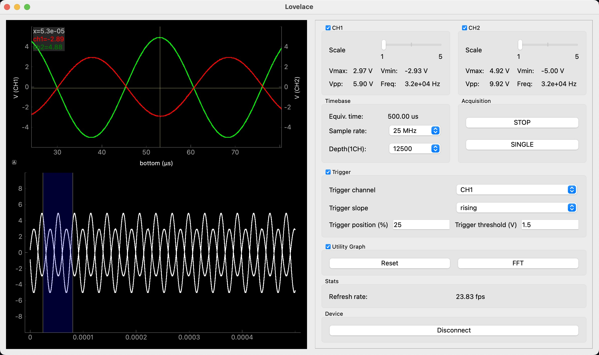
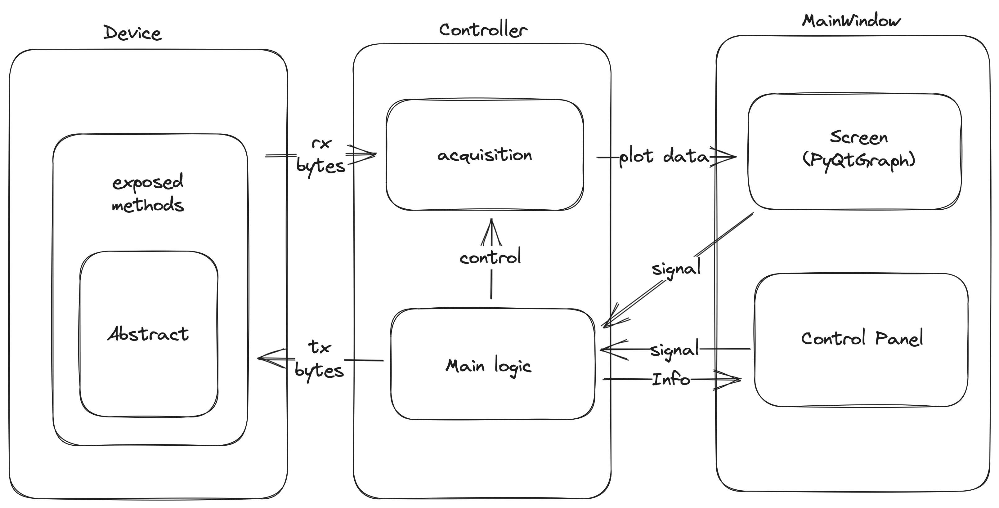

# Lovelace

Lovelace is a USB2.0 based dual-channel oscilloscope that utilizes Xilinx® Artix™ 7 FPGA for signal acquisition.

This is a project that I completed within three weeks. Although it may not be high-profile, it can still meet some basic requirements.

For FPGA source code, please refer to https://github.com/Sped0n/ada.



## Features

*   Acquire speed up to 25MSa/s (single channel)
*   Storage depth of up to 25K (dual channel)
*   Flexible Trigger Configuration (channel/slope/position/threshold)
*   Floating window displays waveform information
*   FFT graph support
*   Zoom in horizontally on the waveform, with the option to move and adjust a specific region
*   Vertical scaling allows waveform to be displayed with proportional magnification

## Installation and usage

1.   Ensure your python version is >= `3.11`, not guaranteed to run on lower version.

     ```shell
     ❯ python --version              
     Python 3.11.5
     ```

2.   Install dependencies.

     ```shell
     pip install -r requirements.txt
     ```

     >   ⚠️⚠️⚠️
     >
     >   When installing `ftd2xx`, please ensure you have [FTDI drivers](https://ftdichip.com/drivers/d2xx-drivers/) installed or available where the linker looks for shared libraries (e.g., PATH on windows, LD_LIBRARY_PATH or standard library directories on Linux).

3.   Load binary file into your board.

     >   Please refer to https://github.com/Sped0n/ada/releases.

4.   Run the app.

     ```shell
     make run
     # or
     python -m lovelace
     ```
     
     To connect to the FPGA, click on the `Connect` button on the bottom. Once the button text changes to `Disconnect`, you are ready to proceed. Click on `RUN` for continuous acquisition or `SINGLE` for a single capture.

## Customization for your specific needs



*   Want to change the communication protocol? Simply implement the corresponding method in `device.py`.
*   Want to display more content? Please make modifications in the `OscilloscopeScreen` class of `main_window.py`.
*   Want to achieve more control options? Simply add the widget you need to the corresponding panel in `main_windows.py` and implement specific logic in `controller.py`.
*   ……

## Credits

*   https://github.com/diepala/wicope
*   https://github.com/WangXuan95/FPGA-ftdi245fifo
